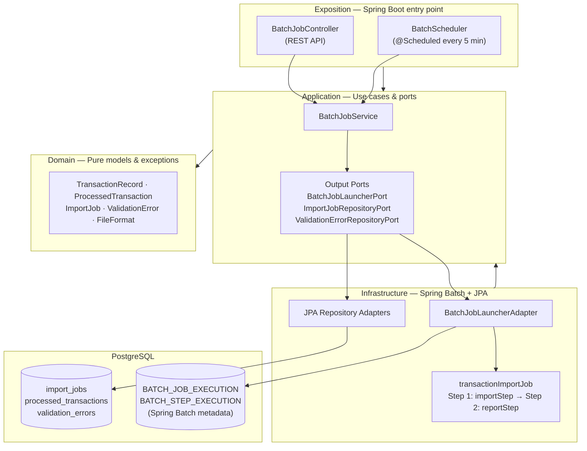
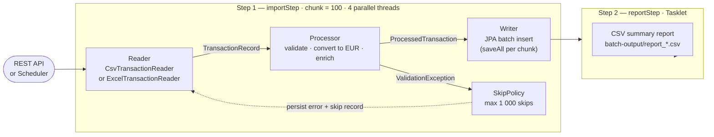

# batch-processing-demo

[](https://github.com/M-Touiti/batch-processing-demo/actions/workflows/ci.yml)
[](https://openjdk.org/projects/jdk/21/)
[](https://spring.io/projects/spring-boot)
[](LICENSE)

A production-grade Spring Batch microservice for processing financial transaction files (CSV and Excel). Demonstrates enterprise batch patterns: chunked processing, skip policy, parallel partitioning, validation, currency conversion, and job monitoring via REST API.

Built as a project applicable to banking, fintech, accounting, and any enterprise system dealing with large-scale file imports.

---

## Architecture

### Module structure (Hexagonal / Ports & Adapters)



### Batch job pipeline



---

## Key Features

| Feature | Implementation |
|---|---|
| **CSV reading** | `FlatFileItemReader` with custom `FieldSetMapper`, handles quoted fields |
| **Excel reading** | Custom `ItemReader` using Apache POI (Spring Batch has no built-in Excel reader) |
| **Validation** | 8 business rules per record (amount, currency, date, required fields) |
| **Skip policy** | Custom `SkipPolicy` — skips `ValidationException`, fails on other errors |
| **Error tracking** | Invalid records saved to `validation_errors` table + accessible via REST |
| **Currency conversion** | Converts all amounts to EUR base currency (configurable FX rates) |
| **Parallel processing** | `ThreadPoolTaskExecutor` with 4 threads for chunk-level parallelism |
| **Job tracking** | `JobExecutionListener` bridges Spring Batch metadata → `import_jobs` table |
| **Report generation** | CSV report per job (totals, success rate, timing) via Tasklet step |
| **Scheduled trigger** | `@Scheduled` watches input directory, auto-processes new files |
| **REST API** | Trigger, poll, and inspect jobs + validation errors |
| **Tests** | Unit (Mockito) + `@SpringBatchTest` integration (Testcontainers PostgreSQL) |

---

## Tech Stack

- **Java 21** — Records, switch expressions, virtual threads ready
- **Spring Batch 5.1** — Chunk-oriented processing, skip/retry, job repository
- **Spring Boot 3.3** — Web, Actuator, Scheduling, Validation
- **Spring Data JPA** — PostgreSQL persistence with batch inserts
- **Apache POI 5.2** — Excel (.xlsx) file reading
- **OpenCSV 5.9** — CSV report generation
- **Testcontainers 1.20** — Real PostgreSQL in `@SpringBatchTest` integration tests
- **Docker / Docker Compose** — Full local environment with pgAdmin

---

## Getting Started

### Prerequisites
- Java 21+
- Docker & Docker Compose

### Option A — full Docker stack (recommended)

```bash
# 1. Clone the repo
git clone https://github.com/M-Touiti/batch-processing-demo.git
cd batch-processing-demo

# 2. Start everything (PostgreSQL + app + pgAdmin)
docker compose up -d

# 3. Open Swagger UI
open http://localhost:8080/swagger-ui.html

# 4. Open pgAdmin (DB browser)
open http://localhost:5050  # admin@demo.com / admin
```

### Option B — local Maven + external DB

```bash
# 1. Start only the database
docker compose up -d postgres pgadmin

# 2. Build and run (scheduler watches ./batch-input/ automatically)
mvn clean install -DskipTests
mvn spring-boot:run -pl exposition
```

### Run tests

```bash
# Unit tests only (Mockito — no infrastructure needed)
mvn test

# Integration tests (@SpringBatchTest + Testcontainers — requires Docker)
# Excluded from the default build. Run explicitly when Docker is available.
# On Docker Desktop for Windows, enable "Expose daemon on tcp://localhost:2375"
# in Settings → General, then:
mvn test -pl exposition -Dsurefire.excludes=
```

---

## API Reference

### Trigger a job

```bash
# Process a CSV file
curl -X POST http://localhost:8080/api/v1/batch/jobs \
  -H "Content-Type: application/json" \
  -d '{
    "filePath": "/path/to/sample-data/transactions_2025_06.csv",
    "fileFormat": "CSV",
    "triggeredBy": "user@example.com"
  }'

# Response (202 Accepted — job runs asynchronously)
{
  "jobId": "42",
  "message": "Job started. Use GET /api/v1/batch/jobs/42 to track progress.",
  "statusUrl": "/api/v1/batch/jobs/42"
}
```

### Poll job status

```bash
curl http://localhost:8080/api/v1/batch/jobs/42
```

```json
{
  "jobId": "42",
  "fileName": "transactions_2025_06.csv",
  "fileFormat": "CSV",
  "status": "COMPLETED",
  "totalRecords": 15,
  "processedRecords": 15,
  "skippedRecords": 0,
  "failedRecords": 0,
  "reportFilePath": "/batch-output/report_42_20250601_143022.csv",
  "triggeredBy": "user@example.com",
  "startedAt": "2025-06-01T14:30:00",
  "completedAt": "2025-06-01T14:30:05",
  "durationSeconds": 5
}
```

### Get validation errors for a job

```bash
curl "http://localhost:8080/api/v1/batch/jobs/42/errors?page=0&size=20"
```

```json
{
  "content": [
    {
      "lineNumber": 3,
      "transactionId": "TXN-ERR-002",
      "fieldName": null,
      "errorMessage": "amount must be positive (got: -100.00)",
      "severity": "ERROR"
    }
  ],
  "totalElements": 1
}
```

### List all jobs

```bash
# All jobs
curl "http://localhost:8080/api/v1/batch/jobs?page=0&size=20"

# Filter by status
curl "http://localhost:8080/api/v1/batch/jobs?status=COMPLETED_WITH_ERRORS"
```

---

## CSV File Format

| Column | Type | Required | Notes |
|---|---|---|---|
| `transactionId` | String | ✅ | Unique identifier |
| `accountId` | String | ✅ | Account reference |
| `amount` | Decimal | ✅ | Positive only, max 10,000,000 |
| `currency` | String | ✅ | EUR, USD, GBP, CHF, JPY |
| `type` | Enum | ✅ | CREDIT, DEBIT, TRANSFER |
| `valueDate` | Date | ✅ | yyyy-MM-dd, max ±5 years |
| `description` | String | ❌ | Max 500 chars |
| `counterpartyId` | String | ❌ | Optional reference |

### Sample files

```
sample-data/
├── transactions_2025_06.csv       ← 15 valid CSV records (all currencies)
├── transactions_with_errors.csv   ← 10 records (4 valid, 6 invalid — tests skip policy)
└── transactions_sample.xlsx       ← 20 valid Excel records (all currencies + types)
```

---

## Validation Rules

| Rule | Error |
|---|---|
| `transactionId` blank | `transactionId is required` |
| `accountId` blank | `accountId is required` |
| `amount` null | `amount is required` |
| `amount` ≤ 0 | `amount must be positive` |
| `amount` > 10,000,000 | `amount exceeds maximum allowed` |
| `currency` not in EUR/USD/GBP/CHF/JPY | `unsupported currency: XYZ` |
| `type` null | `type is required` |
| `valueDate` null | `valueDate is required` |
| `valueDate` > now + 30 days | `valueDate cannot be more than 30 days in the future` |
| `valueDate` < now - 5 years | `valueDate cannot be more than 5 years in the past` |
| `description` > 500 chars | `description exceeds max length` |

---

## Job Status Flow

```
Trigger (API / Scheduler)
        │
        ▼
    RUNNING
        │
   ┌────┴────┐
   ▼         ▼
COMPLETED  COMPLETED_WITH_ERRORS  ←  (skipped records > 0)
                │
                ▼
             FAILED  ←  (unexpected error or skip limit exceeded)
```

---

## Spring Batch Monitoring via Actuator

```bash
# All Spring Batch job executions
GET /actuator/batch/jobs

# Specific job
GET /actuator/batch/jobs/{jobName}

# Step executions
GET /actuator/batch/steps
```

---

## Project Structure

```
batch-processing-demo/
├── domain/             Pure domain model (TransactionRecord, ProcessedTransaction, ImportJob, ...)
├── application/        BatchJobService, ports (BatchJobLauncherPort, ImportJobRepositoryPort, ...)
├── infrastructure/     Spring Batch config, readers (CSV/Excel), processor, writer, listener,
│                       skip policy, JPA entities, repositories, adapters
└── exposition/         BatchApplication, BatchJobController, BatchScheduler, application.yml
    └── test/           Unit (Mockito) + @SpringBatchTest integration (Testcontainers)

sample-data/
├── transactions_2025_06.csv         ← 15 valid records
└── transactions_with_errors.csv     ← mix of valid and invalid records
```

---

## Design Decisions

**Why a custom Excel reader instead of a library?**
Spring Batch has no built-in Excel reader. The custom `ExcelTransactionReader` using Apache POI directly mimics `FlatFileItemReader`'s streaming behavior, keeping memory usage low even for large files (reads row-by-row, not loading the full workbook).

**Why save ValidationErrors to DB during processing?**
Writing errors to the DB in the processor (not in a separate step) ensures errors are persisted even if the job is interrupted. The REST API can then serve them immediately without parsing log files.

**Why chunk size = 100?**
Matches the JPA `batch_size` configuration, enabling PostgreSQL to execute a single `INSERT ... VALUES (...)` batch statement per chunk. Much faster than 100 individual inserts.

**Why a Tasklet for the report step?**
Report generation is not chunk-oriented (it's a single operation reading aggregated counts from the job context). A `Tasklet` is the correct Spring Batch abstraction for non-chunked work.

---

## License

MIT
